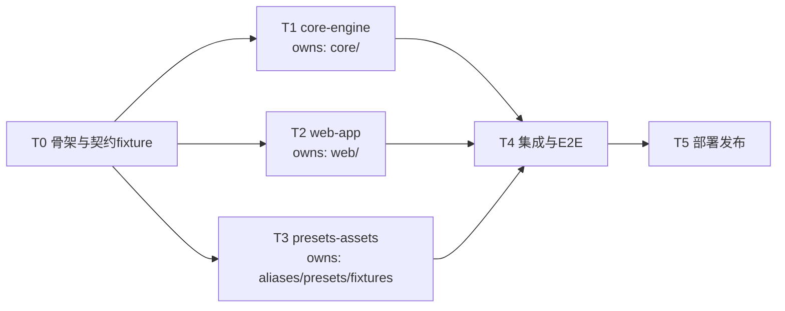

# 04 · 任务卡（每张卡 = 一个开发代理的任务书）

## 依赖图与执行顺序

T0 必须最先完成；T1/T2/T3 可三个代理并行；T4、T5 串行收尾。

## 通用约束（每张任务卡默认包含，分发时随卡附上）

1. 开工前必读：`README.md`、`docs/01-architecture.md`、`docs/02-contracts.md`、本任务卡；T1 另需 `docs/05-migration-map.md`。
2. 仓库根：`/Users/peyoba/Documents/Obsidian Vault/项目/bomkit`。并行任务（T1/T2/T3）各自建 worktree：先 `cd` 到仓库根，再执行任务卡中的 `git worktree add` 命令，在 worktree 内工作，**只允许修改任务卡"边界"列出的路径**。
3. 旧仓库只读参考：`/Users/peyoba/Documents/Obsidian Vault/项目/jlc_bom_converter/jlc_bom_converter`。
4. 红线：公司真实数据只放 `core/tests/fixtures/private/`（gitignored），永不提交；不修改 `docs/02-contracts.md`；契约有缺陷时停下报告，不自行变更。
5. 提交规范：Conventional Commits，末尾附 `Co-Authored-By: Warp <agent@warp.dev>`；小步提交。
6. 完成报告格式：分支名、改动文件清单、如何运行/测试（精确命令）、测试结果、遗留问题与 TODO。

---

## T0 · 骨架与契约 fixture

- 目标：让 T1/T2/T3 能并行开工的最小骨架。
- 边界：全仓库（此时尚无并行代理）。直接在 main 分支工作。
- 任务：
  1. `core/`：pyproject.toml（包名 bomcore，src 布局，依赖仅 openpyxl，dev 依赖 pytest/ruff/build），空模块文件与 docstring 占位，`pip install -e core/` 可用；`python -m build --wheel` 可产出 wheel。
  2. `web/`：Vite + React + TS + AntD 5 + Zustand 脚手架，`npm run dev/build/test` 可用；建 `src/types/contracts.ts` 把 `02-contracts.md` 的全部结构翻译为 TS 类型；`public/pyodide/.gitkeep`。
  3. `cli/`：入口占位（argparse 骨架，参数兼容旧工具：输入文件、`-o`、`-m`、`--pcba-name` 等，见旧仓库 `jlc_bom_converter.py`）。
  4. 契约 fixture（`core/tests/fixtures/contract/`）：手工构造合成数据——`bom_rows.json`（≥15 行，覆盖：可精确匹配、型号匹配、子串匹配、参数匹配、多候选、未匹配、非物料 hole/test-point、DNP 行、需合并的重复行）、`material_rows.json`（≥20 条，含禁用条目、`01.` 与 `30.` 编码段、带前导零编码）、`profiles.json`、`analyze_expected.json`（人工推演期望输出，之后由 T1 实现对齐）、`detect_cases.json`（≥6 用例：标准表头、表头在第 3 行、中英混合表头、无法识别表头、金蝶物料表、旧简易表）。
  5. 从旧仓库复制真实样例到 `core/tests/fixtures/private/`（确认 gitignore 生效后再复制）：嘉立创 BOM、金蝶物料表、公司模板、旧工具输出各一份。
- 验收：三个子工程构建命令全部成功；fixture JSON 语法与 schema 自洽；`git log` 干净（真实数据未入库，用 `git status --ignored` 验证）。

## T1 · core-engine（Python 核心库）

- 目标：把旧核心重构为 bomcore 包，行为与旧工具等价，接口符合契约。
- worktree：`git worktree add ../bomkit-wt-core -b feat/core main`
- 边界：只改 `core/`（presets/aliases 目录除外——那是 T3 的，冲突时以 T3 为准，T1 只放最小占位词库供测试）。
- 任务：
  1. 按 `05-migration-map.md` 的映射表迁移旧代码到各模块，去 pandas（groupby 手写、读取走 rows JSON）。
  2. 实现 `api.py`：`detect/analyze/render` 三函数，输入输出严格符合 `02-contracts.md` 第 5/6 节。
  3. 匹配管线按 match_config 参数化（现硬编码常量全部提为配置，默认值 = 契约 3.3）。
  4. render 支持 output_template Profile（base_xlsx_b64 加载与程序化生成两条路径；内置默认模板复刻旧 create_excel 样式）。
  5. 迁移旧仓库 `tests/` 全部测试并补新测试（detect、schema 校验、指纹、api 层契约测试——用 T0 的 contract fixture 断言）。
  6. 写黄金回归脚本 `core/tests/golden_compare.py`：用 private 真实数据跑新链路，与旧工具输出逐单元格比对（值+状态文字+填充色），输出差异报告。
  7. CLI 薄壳实装（复用 api.py，参数兼容旧工具）。
- 验收：`pytest core/tests -v` 全绿；黄金回归差异为零或逐条经确认；wheel 构建成功且在纯净 venv 中 `pip install` 后 CLI 可跑通真实转换。
- 完成报告需额外包含：黄金回归差异清单（若有）、`analyze_expected.json` 与实现不一致时的修正说明。

## T2 · web-app（React SPA）

- 目标：完整前端，先以 mock 跑通全流程，Pyodide 设施就绪待接真 wheel。
- worktree：`git worktree add ../bomkit-wt-web -b feat/web main`
- 边界：只改 `web/`。
- 任务：
  1. `lib/xlsx.ts`：SheetJS 读取（严格按契约第 2 节字符串化规则）；前 50 行快速读取用于 detect。
  2. detect 的 TS 实现（契约第 5 节算法），用 `detect_cases.json` 做 Vitest 用例。
  3. `lib/profiles.ts`：localStorage CRUD、指纹计算（契约 4.1/4.2，Web Crypto sha256）、Jaccard 相似推荐、JSON 导入导出。
  4. Worker 桥：`pyodide.worker.ts` 消息协议（契约 6 节）；开发模式提供 mockWorker（读 contract fixture 返回）；Pyodide 真实加载路径用占位 wheel 演练（加载进度事件→UI 进度条）。
  5. 页面：Home（落地页：一句话价值 + 隐私说明 + 开始按钮）、Wizard（AntD Steps 四步：BOM 上传映射 → 物料库上传映射（可跳过）→ 输出模板选择/标注 → 转换）、Preview（虚拟滚动表格、状态着色按契约 7 节、CandidatePicker 单选、手改编码输入、stats 汇总条、导出按钮）。
  6. TemplateAnnotator：上传模板 xlsx → 网格预览（SheetJS 渲染前 20 行）→ 点选数据起始行 → 每列下拉选字段 → meta_cells 点选标注 → 生成 output_template Profile（base_xlsx_b64 存入）。
  7. Service Worker：缓存 `public/pyodide/*`。
- 验收：Vitest 全绿（含 detect_cases 共享用例）；mock 模式下完整向导流程人工可走通；`npm run build` 无 TS 错误；Profile 保存后刷新页面指纹复用生效。
- 完成报告需额外包含：dev server 启动命令、mock 与真实 Worker 的切换方式说明（供 T4 使用）。

## T3 · presets-assets（预设与词库）

- 目标：内置预设、别名词库、多格式测试 fixture。
- worktree：`git worktree add ../bomkit-wt-assets -b feat/assets main`
- 边界：只改 `core/src/bomcore/aliases/`、`core/src/bomcore/presets/`、`core/tests/fixtures/`（contract/ 子目录除外，那是 T0 的）。
- 任务：
  1. 网络调研并记录来源：KiCad（bom_csv_grouped 等常用插件输出）、Altium Designer（默认 BOM 模板列名）、立创EDA 标准版、嘉立创 EDA 专业版导出列名的准确拼写（含中英文版本差异）。
  2. 别名词库：中间模型每个字段一个 JSON（契约 5.3 格式），中英文别名尽量全。
  3. 内置 Profile：上述每种 EDA 一份 `bom_input` 预设；金蝶完整物料表 + 旧简易编码表两份 `material_input` 预设；默认输出模板一份（复刻旧工具列布局，契约 3.2 示例即为其骨架）。
  4. 每种预设制作一个合成 fixture xlsx（openpyxl 脚本生成，数据虚构），放 `core/tests/fixtures/inputs/`；生成脚本一并入库（`core/tests/fixtures/generate_fixtures.py`）。
  5. 扩充 `detect_cases.json`：每种预设至少 2 个探测用例（注意与 T0 已有用例合并而非覆盖）。
- 验收：所有 JSON 通过 schema 自检脚本；fixture xlsx 可被 openpyxl 与 SheetJS 正常读取；完成报告附调研来源链接清单。

## T4 · 集成与端到端（T1/T2/T3 完成后）

- 目标：合并、接真、验证，达到 M2 验收门。
- 边界：全仓库（此时并行代理已结束）。
- 任务：
  1. 按 feat/core → feat/assets → feat/web 顺序合入 main，处理冲突；`git worktree remove` 清理三个 worktree。
  2. 构建 bomcore wheel + 下载 pin 版本的 Pyodide runtime + openpyxl wheel 放入 `web/public/pyodide/`；写构建脚本 `web/scripts/prepare-pyodide.mjs` 固化此过程。
  3. web 切换真实 Worker，删除/降级 mock 为测试专用；对齐 `analyze_expected.json` 与真实引擎输出。
  4. 跑黄金回归（T1 脚本 + private 数据）；跑全部 pytest/Vitest。
  5. Playwright E2E 三条用例（M2 验收门定义）；异常路径测试（错列/空文件/5000 行大文件）。
  6. 性能与加载体验收尾：进度条真实数据、SW 缓存验证、Lighthouse 检查。
- 验收：M2 验收门全部满足（见 `03-milestones.md`）。

## T5 · 部署与发布（T4 完成后）

- 目标：上线 + 可推广。
- 任务：
  1. Cloudflare Pages 部署（连 GitHub 仓库或 wrangler 直传；注意 SPA 路由回退与 `public/pyodide` 正确发布；配置 wasm/whl 的 MIME 与缓存头）。
  2. 推 GitHub 远端（先跑 `git log --stat` 全量复查，确认无公司数据）。
  3. 落地页文案定稿：价值主张、隐私说明（含"如何用开发者工具验证无上传"）、支持格式列表、使用三步图。
  4. 用户版 README + 常见问题（参考旧仓库 SOP.md 的 FAQ 结构）。
  5. 推广素材草稿：面向立创社区/电子发烧友的介绍帖（问题-方案-隐私-链接结构），交任务分发者审核后发布。
- 验收：线上 URL 真实浏览器全流程手测通过；M3 验收门满足。
